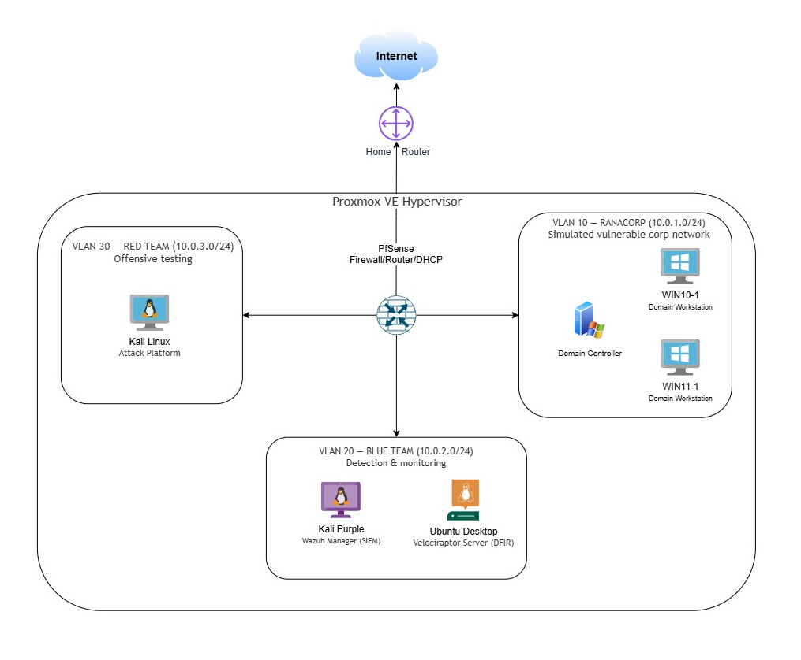

# RANACORP Security Operations Homelab

A self-hosted, segmented enterprise simulation built to practice and demonstrate
core **SOC Analyst** skills: SIEM monitoring, endpoint DFIR, Active Directory
administration, network segmentation, firewall policy design, and red team /
blue team exercises.

> **Note on IP addressing:** Home network / management IPs and any public
> (WAN) address have been redacted or genericized throughout this repo.
> Internal lab VLANs use private RFC1918 ranges shown below and are safe to
> publish as-is.

---

## 1. Purpose

This lab was built to simulate a small corporate network ("RANACORP") that is
intentionally vulnerable, alongside an isolated Blue Team monitoring stack and
a Red Team attack platform — all on a single Proxmox hypervisor, segmented at
Layer 3 by a pfSense firewall.

Goals:
- Practice triaging alerts in a real SIEM (Wazuh)
- Practice endpoint forensics / threat hunting (Velociraptor)
- Manage a Windows Active Directory domain end-to-end
- Design and enforce inter-VLAN firewall policy (deny-by-default segmentation)
- Run controlled attacks from a Red Team VLAN and observe detections in Blue Team tooling
- Document findings the way an analyst would in a real SOC

---

## 2. Architecture Diagram

## 3. Hypervisor

| Component | Detail |
|---|---|
| Platform | Proxmox VE 9.2.3 |
| CPU | Intel Core i5-10500T (12 threads, 1 socket) |
| RAM | 32 GB |
| Storage | Local + dedicated VM storage pool |
| Networking | Dedicated Linux bridge trunked to pfSense, VLAN-aware |

---

## 4. Network Segmentation

| VLAN | Name | Subnet | Role |
|---|---|---|---|
| 10 | RANACORP | 10.0.1.0/24 | Simulated corporate domain (intentionally vulnerable target network) |
| 20 | BLUETEAM | 10.0.2.0/24 | SIEM / DFIR / monitoring infrastructure |
| 30 | REDTEAM | 10.0.3.0/24 | Offensive security / attack platform |
| — | WAN/HOME | (redacted) | Management access to hypervisor & firewall UI only |

DHCP for all VLANs is handled by pfSense. Inter-VLAN routing exists only where
explicitly permitted below — everything else is default-deny.

---

## 5. Firewall Policy (pfSense)

Rules are enforced per-interface with a default-deny posture. Summary (sanitized):

**WAN**
- Inbound management access to internal UIs (Wazuh, Velociraptor, pfSense) restricted to the home/admin network only, over HTTPS/designated ports.
- All other inbound WAN traffic blocked.

**RANACORP (VLAN10) → BLUETEAM (VLAN20)**
- Allowed: Wazuh agent enrollment + event log shipping (TCP 1515, TCP/UDP 1514)
- Allowed: Velociraptor agent enrollment + event log shipping (TCP 8000, TCP 8889)
- All other RANACORP → BLUETEAM traffic blocked

**RANACORP (VLAN10)**
- Blocked outbound to REDTEAM, BLUETEAM (except the monitoring ports above), and Home network
- Allowed outbound to internet (for OS/patch traffic, simulating a real corp network)

**BLUETEAM (VLAN20)**
- Blocked outbound to Home network and REDTEAM
- Allowed outbound to internet (updates, threat intel feeds)

**REDTEAM (VLAN30)**
- Blocked outbound to Home network and BLUETEAM
- Allowed outbound to internet
- Attacks against RANACORP are permitted intentionally as part of exercises (governed manually, not by a standing allow rule)

This mirrors a real enterprise pattern: monitoring agents can talk to the SIEM/DFIR
collectors, but lateral movement between segments is otherwise blocked, and the
red team range is isolated from both the blue team infrastructure and the home
network.

---

## 6. Tooling Stack

| Layer | Tool | Purpose |
|---|---|---|
| Hypervisor | Proxmox VE | Runs all VMs/CTs |
| Firewall / Router / DHCP | pfSense | VLAN segmentation, inter-VLAN ACLs, DHCP |
| SIEM | Wazuh (on Kali Purple) | Log aggregation, correlation, alerting across all domain endpoints |
| DFIR / EDR | Velociraptor (on Ubuntu Desktop) | Live endpoint forensics, hunting, artifact collection |
| Directory Services | Windows Server (AD DS) | Domain controller for RANACORP domain |
| Endpoints | Windows 11 / Windows 10 | Domain-joined simulated corporate workstations |
| Offensive Platform | Kali Linux | Red team tooling for authorized internal attacks |

---

## 7. Skills Demonstrated

- **SIEM administration & triage** — deploying Wazuh, onboarding agents, tuning rules, investigating alerts
- **Endpoint DFIR** — using Velociraptor to hunt and collect forensic artifacts across a domain
- **Active Directory administration** — building and managing a Windows domain
- **Network security architecture** — VLAN segmentation with least-privilege, default-deny firewall rules
- **Detection engineering** — validating that red team activity generates the expected alerts/artifacts in Blue Team tooling
- **Documentation** — writing this repo the way an analyst documents environments and findings for a team

---
