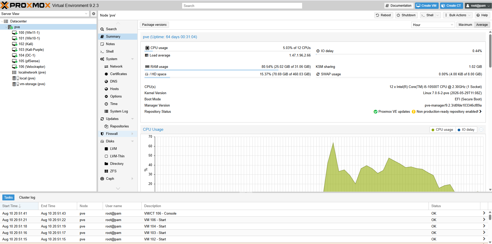
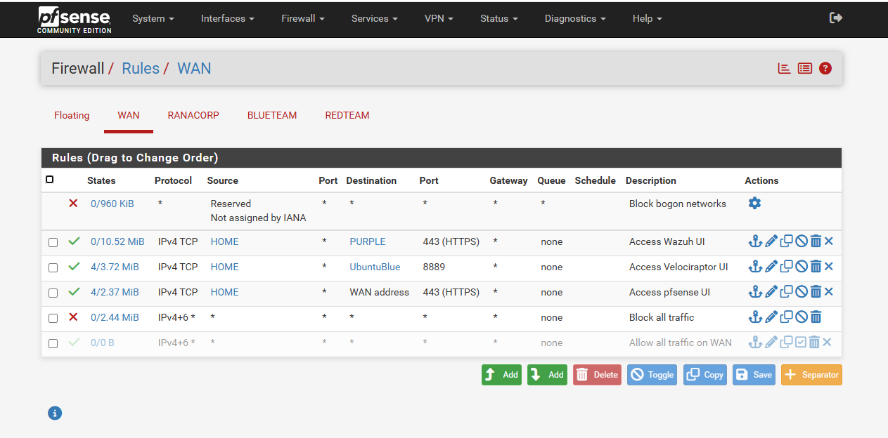
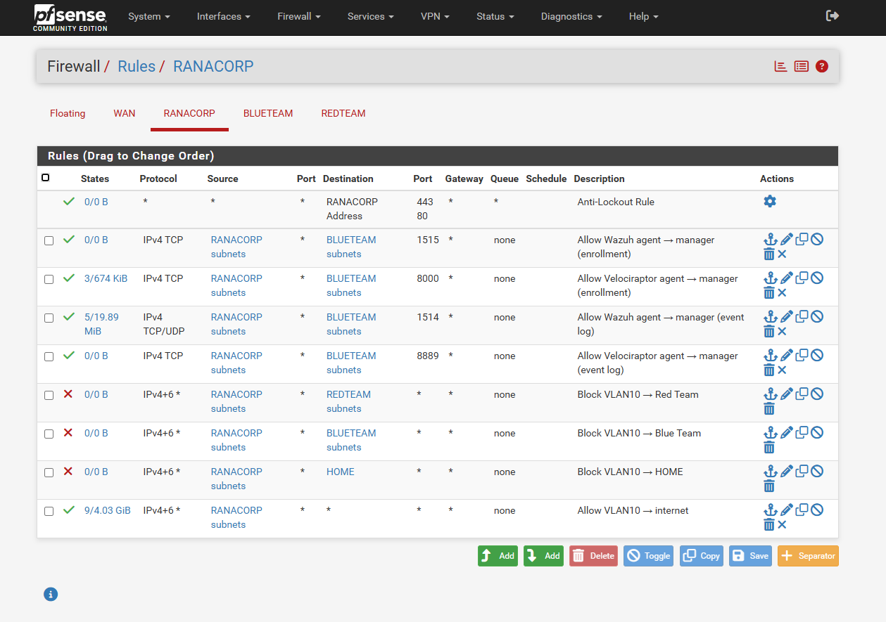
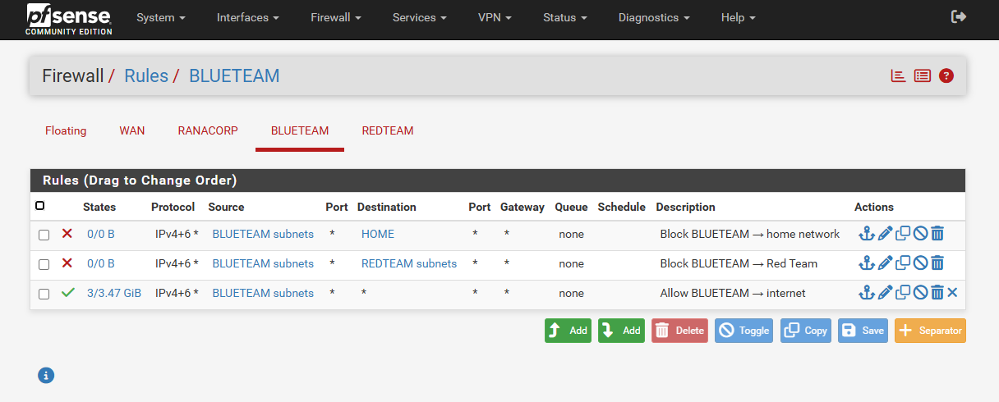
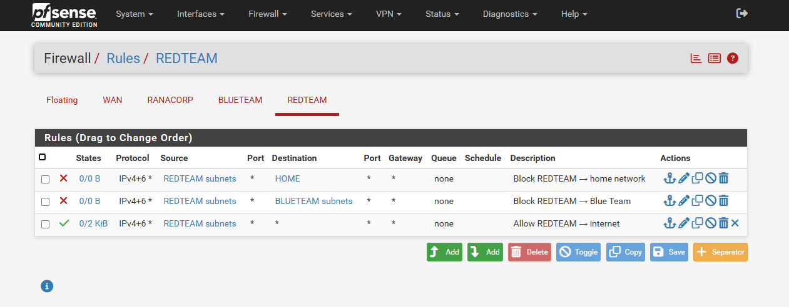
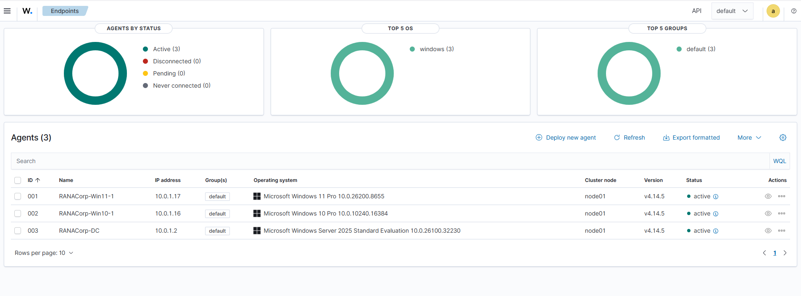
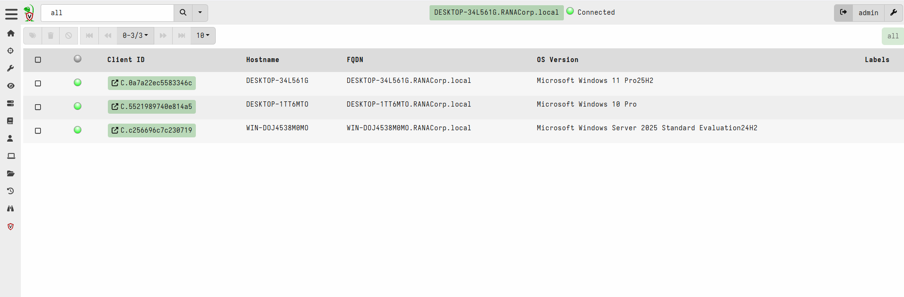
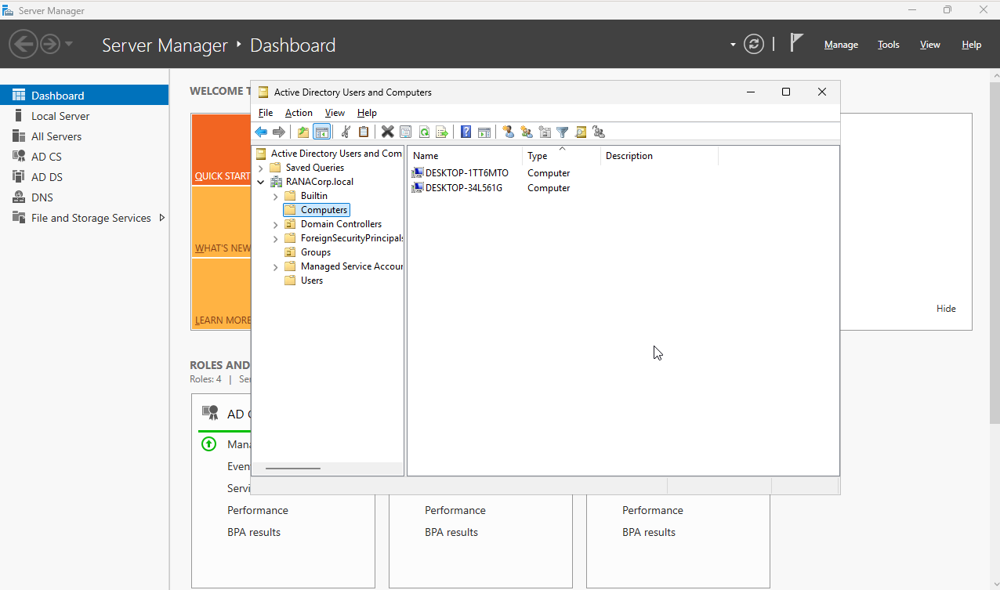
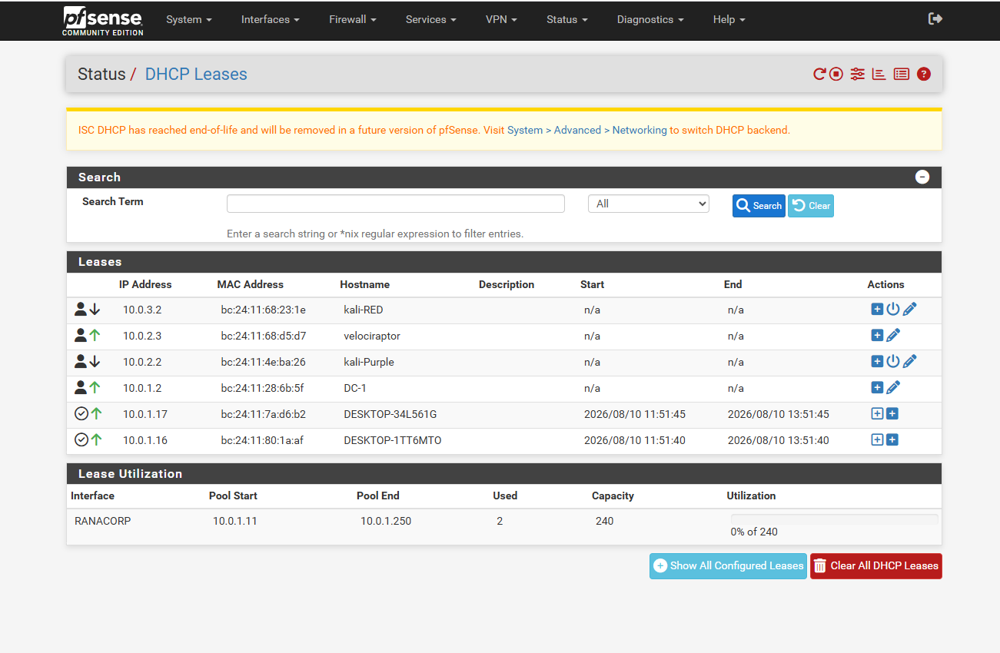

# Screenshots

Visual evidence of the lab actually running — hypervisor state, firewall
policy, and the segmentation described in the main [README](../README.md) in
action.

All images are redacted per the checklist near the bottom of this page before
being committed — internal VLAN addressing (10.0.x.x) stays visible since
it's non-sensitive private range, but anything tying the lab to a real
identity or network is scrubbed first.

## Naming Convention

`<component>-<view>.png`, e.g. `proxmox-summary.png`, `pfsense-wan-rules.png`.

## Index

| File | Component | Shows |
|---|---|---|
| `proxmox-summary.png` | Proxmox VE | Node summary — CPU/RAM/disk usage, running VMs/CTs, uptime |
| `pfsense-wan-rules.png` | pfSense | WAN interface firewall rules (inbound access to internal UIs, default deny) |
| `pfsense-ranacorp-rules.png` | pfSense | VLAN10 (RANACORP) firewall rules — monitoring agent allow-list, inter-VLAN deny |
| `pfsense-blueteam-rules.png` | pfSense | VLAN20 (BLUETEAM) firewall rules — outbound-only posture |
| `pfsense-redteam-rules.png` | pfSense | VLAN30 (REDTEAM) firewall rules — isolated from home/blue team |
| `Wazuh-dashboard.png` | Wazuh | Agent list showing DC-1/Win11-1/Win10-1 enrolled |
| `velociraptor-console.png` | Velociraptor | Client list connected with Velociraptor |
| `ad-users-and-computers.png` | Windows Server (AD DS) | Active Directory Users and Computers |
| `pfsense-dhcp-leases.png` | pfSense | DHCP leases across VLAN10/20/30 |

### Proxmox VE — Node Summary
 

### pfSense-WAN interface firewall rules
 

### pfSense-RANACORP interface firewall rules
 

### pfSense-BLUETEAM interface firewall rules
 

### pfSense-REDTEAM interface firewall rules
 

### Wazuh Dashboard (Agents List)
 

### Velociraptor Console
 

### Windows Server (AD DS) -Computers and Users

### pfSense - DHCP leases across VLAN10/20/30

## Redaction Checklist (checked before every commit)

- [ ] Real home/WAN IP addresses blurred or replaced with a placeholder
- [ ] Hostnames that reveal personal identity removed/blurred
- [ ] MAC addresses blurred
- [ ] Browser bookmark bars / OS taskbar cropped out
- [ ] No credentials, tokens, or API keys visible

Internal VLAN IPs (10.0.x.x) and Proxmox hardware specs are safe to leave visible.
